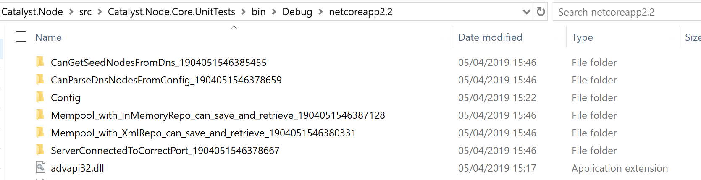

# Integration tests in Catalyst.Node

>As explained in [How is Autofac used in Catalyst.Node](autofac.md), the Catalyst node is using a set of configuration files to choose and configure its dependencies. When writing integration tests involving several layers of dependencies, it would be cumbersome to have to reconfigure a large part of the container for each new test.  
>This article will try explain a couple of tips that should help reducing the pain that comes with writing such tests.

## Using the file system

For integration tests to be able to run independently of each others whilst using the file system, they need to inherit from `Catalyst.Node.Common.UnitTests.TestUtils.FileSystemBaseTest`. This class creates a unique folder for each test run and might clean older folders upon getting disposed.  
As an example, this screen shot shows what that a few folders have been created in the output folder of our test project. 
- The _Config_ folder contains configurations similar to the ones used by the node when running normally, which can be referenced to configure the container used in a given integration test.
- Other folders such as _Mempool_with_InMemoryRepo_... are created

