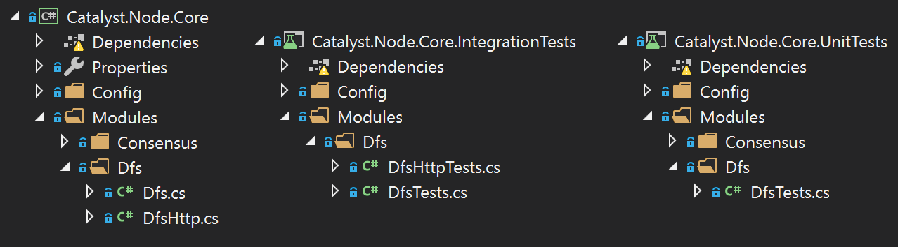

# Project Guidelines

Whenever a guideline is not explicitly given in this document, please refer the [.Net Framework Design Guidelines](https://docs.microsoft.com/en-us/dotnet/standard/design-guidelines/) to make your own decision.

## Code style

When contributing to this repository, please make sure you respect the code style it defines.

The policy is fairly standard and simple and is mostly enforced through the [DotSettings](https://github.com/catalyst-network/Catalyst.Node/blob/develop/src/Catalyst.sln.DotSettings) file at the solution level. If you are not using Resharper or Rider to assist you when writing code, this file might not be of any use to you, unfortunately.  We will try to translate more of these rules in the _.editorconfig_ file soon.

A [Codacy](https://www.codacy.com) bot relying on [Sonar C#](https://github.com/SonarSource/sonar-dotnet) will analyse incoming pull requests and provide advice to ensure your code is of suitable quality. Although sometimes the bot might not be right, it creates the basis for a mutual understanding of code quality that is shared by the 120,000+ users of [SonarQube](https://www.sonarqube.org).

## Testing

### Unit tests Vs Integration tests

We try to draw a distinction between unit tests, which are self-contained tests only meant to ensure a given functionality works as expected in isolation of the other functionalities it might depend on, and integration tests, which typically encompass a wider range of functionalities, possibly connections to the network or database, and are meant to reproduce and test real-life executions scenarios.

When unit testing, and in order to keep the test-focused, we often need to use mocks of the implementation a functionality depends on. [NSubstitute](https://nsubstitute.github.io/) is used for that throughout the codebase.

In this example, we are trying to test part of the `DeltaVoter` without involving actual implementations of other services like `IMemoryCache`, `IDeltaProducersProvider` or `ILogger`
```csharp
_cache = Substitute.For<IMemoryCache>();
_producersProvider = Substitute.For<IDeltaProducersProvider>();
var logger = Substitute.For<ILogger>();

_voter = new DeltaVoter(_cache, _producersProvider, logger);
```

For integration testing, however, we would typically rely, even if partially only, on actual implementations of those services.

### What needs to be unit tested?
Testing is generally done by accessing the public methods and properties of a class and validating the consequences of the calls through public methods too. It is usually enough to check that an implementation respects the contracts drawn in its interfaces.

If you need that you need to test your private methods, and then check the state of the class reflecting through its private properties, think again, it smells like you are doing it wrong.

### Folder structure

Every project is accompanied by the corresponding .UnitTests and .IntegrationTests projects. The file structure should be identical between the 3 projects, making it easy for the reader to find the different tests for a given class.

As an example, here we see that the Dfs class is 



### Naming
It is our opinion that test methods are allowed to get pretty verbose, in an attempt to describe the purpose of a given test. With this in mind, for readability purposes, we would rather you write `MyTestedMethod_Should_Be_Producing_This_Result_When_Some_Conditions_Are_Met()` than `MyTestedMethodShouldBeProducingThisResultWhenSomeConditionsAreMet()`.
There are a few instances of `MyTestedMethod_should_be_producing_this_result_when_some_conditions_are_met()` in the code, but they are a reminder from the past and we now prefer moving towards capital letters.

## Language

British English is preferred over other dialects throughout the solution. You can `Serialise` something but it is frowned upon to `Serialize` it.

## Comments

- Private methods rarely need to be commented, expressive code is preferred.
- Comments that do not add value such as these

``` csharp
/// <summary>
/// </summary>
/// <param name="dns"></param>
/// <param name="repository"></param>
/// <param name="rootSection"></param>
/// <param name="logger"></param>
public PeerDiscovery(IDns dns,
    IPeerRepository repository,
    IConfigurationRoot rootSection,
    ILogger logger)
{
    ...
```
 are not worth the pain involved in maintaining them, or the cognitive overload they create on the reader. Yes there are quite a few instances of these in the code, but we are working towards sanitisation 😂
 
- Interface methods should be documented in a human readable way, and describe the functionalities offered by the interface

``` csharp
/// <summary>
///   Provides read-write access to a distributed file system.
/// </summary>
public interface IDfs
{
    /// <summary>
    /// Add some text to the distributed file system.
    /// </summary>
    /// <param name="content">The text to add to the DFS.</param>
    /// <param name="cancellationToken">A cancellation token that can be used to cancel the work.</param>
    /// <returns>The unique ID to the content created on the DFS.</returns>
    Task<string> AddTextAsync(string content, CancellationToken cancellationToken = default);
...
```

After that, the methods implementing this interface should not need much more than an `<inheritdoc />` to provide information through intellisense.

``` csharp
/// <inheritdoc />
public sealed class Dfs : IDfs
{
    /// <inheritdoc />
    public async Task<string> AddTextAsync(string content, CancellationToken cancellationToken = default)
    {
        var node = await _ipfs.FileSystem.AddTextAsync(
...
```

### Todos
_Todo_ comments shoul not be added to the codebase without a vali url pointing to the corresponding github issue. Fortunately, upon inserting a todo, Codacy can be used to create an issue.

## License Header

All .cs files in the code should be prefixed by our license header, but don't worry, a test will remind you to do so if you forget.